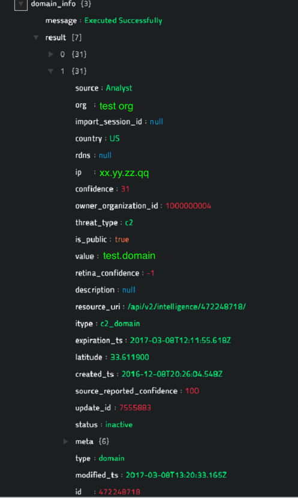
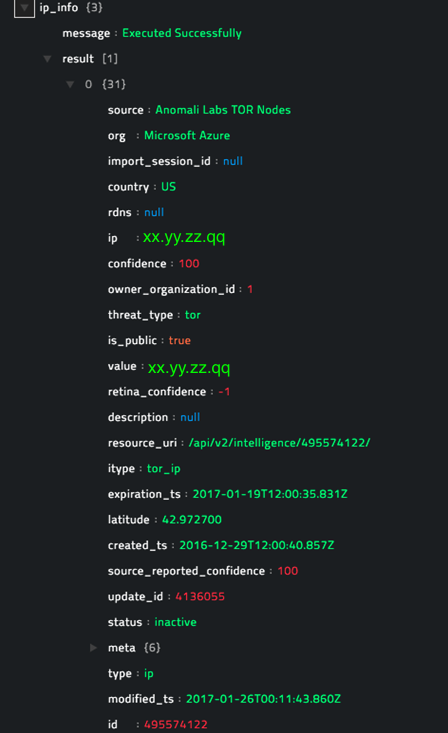
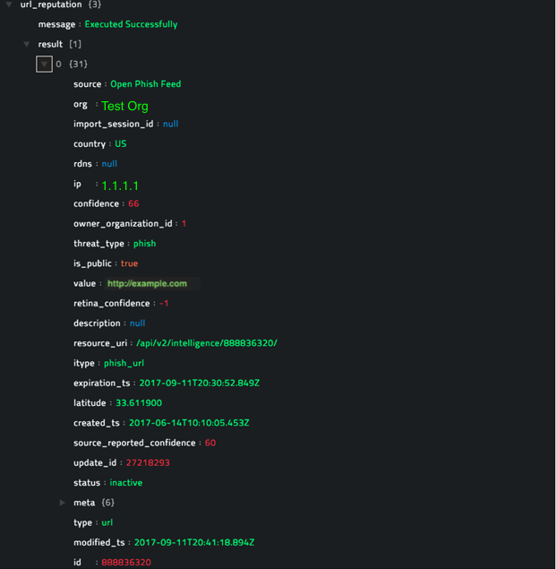
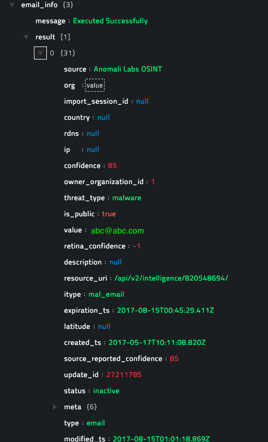
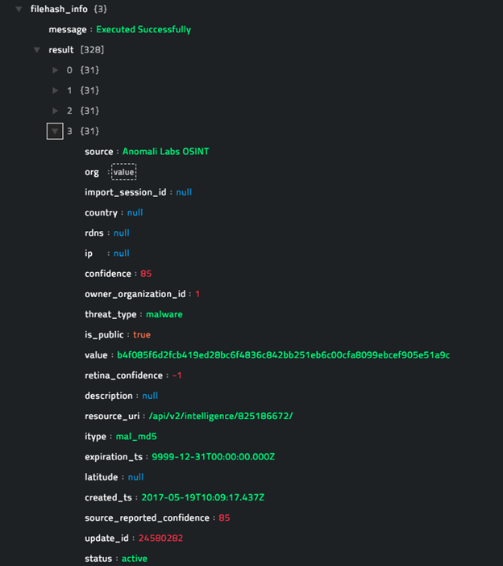
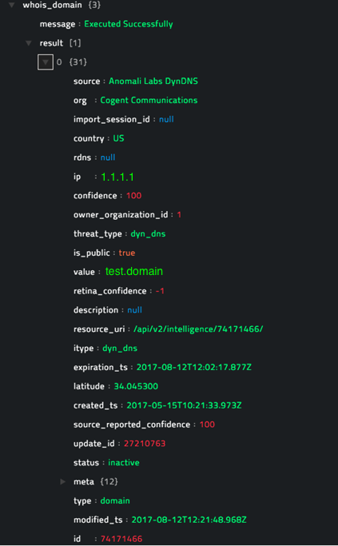
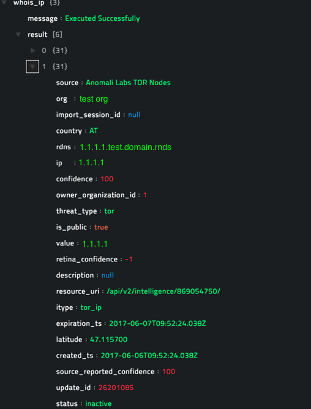
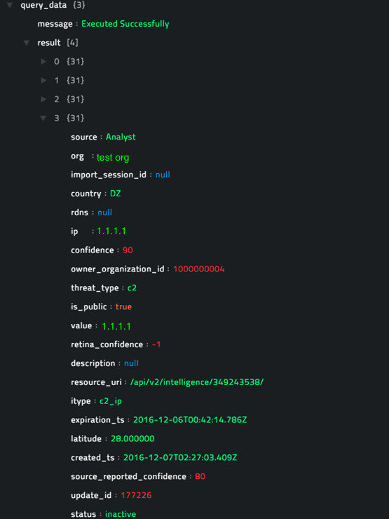
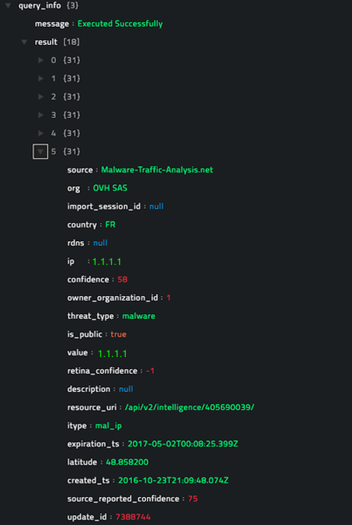

## About the connector

Anomali ThreatStream offers the most comprehensive Threat Intelligence Platform, allowing organizations to access all intelligence feeds and integrate it seamlessly with internal security and IT systems.

This document provides information about the Anomali ThreatStream connector, which facilitates automated interactions, with  ThreatStream server using CyOPs™ playbooks. Add the Anomali ThreatStream connector as a step in CyOPs™ playbooks and perform automated operations, such as automatically getting reputation of an IP address, URL, File, Email, or Domain providing you the ability to investigate and contain a file-based incident in a fully automated manner.

### Version information
Connector Version: 1.0.1

Compatibility with CyOPs™ Versions: 4.9.0.0-708 and later

Compatibility with Anomali ThreatStream API Version: v2

### Release Notes for version 1.0.1

Following enhancements have been made to the `Anomali ThreatStream` Connector in version 1.0.1:

- Updated configuration parameters. 
- Added `Validate Input` parameter for all operations, except Run Filter Language Query and Run Advance Query.
- Added annotations to functions.

## Installing the connector

All connectors provided by  CyOPs™ are delivered using a CyOPs™ repository. Therefore, you must set up your CyOPs™ repository and use the `yum` command to install connectors:

`yum install cyops-connector-threatstream`

To update a  CyOPs™-provided connector use the following command:

`yum update cyops-connector-threatstream`

To remove a  CyOPs™-provided connector use the following command:

`yum remove cyops-connector-threatstream`

The process to write your own custom connector is defined in the `Building a custom connector` topic.

## Prerequisites to configuring the connector

- You must have the URL of ThreatStream server to which you will connect and perform the automated operations and the credentials to access that server.
- You must have a registered username for the ThreatStream server and the API key for a ThreatStream API integration.
- To access the CyOPs™ UI, ensure that port 443 is open through the firewall for the CyOPs™ instance.

## Configuring the connector

!!! Note  
		This procedure assumes that you are using CyOPs™ version 4.10.1. If you are using a different version of CyOPs™, such as CyOPs™ 4.9, then it is possible that the CyOPs™ UI navigation is different. Refer to the CyOPs™ documentation of that particular version for details about CyOPs™ navigation.

1. In CyOPs™, on the left pane, click **Automation** > **Connectors**.   
   On the `Connectors` page, you will see the `Anomali ThreatStream` connector.
2. To configure the connector parameters, click **Configure** and enter the required configuration details in the **Configurations** tab.  
   You must provide configuration parameters such as the IP address or Hostname of the ThreatStream server and credentials to access that server. You must also provide your API for the ThreatStream API integration.   
   For a complete list of configuration parameters, see the [Configuration parameters](#Configuration-parameters) section.  
   **Note**: You can add multiple configurations if you have more than one ThreatStream server instances in your environment. You must, therefore, specify a unique `Name` to identify each configuration in your environment.  
   If you have previous versions of a connector and you are configuring a newer version of that connector, with the same configuration parameters, then CyOPs™ fetches the configuration and input parameters of the latest available version of that connector. For example, If you have 1.0.0, 1.1.0, and 1.2.0 versions of the Anomali ThreatStream connector and you are configuring the 1.3.0 version of the Anomali ThreatStream connector, then while configuring the 1.3.0 version,  CyOPs™ will fetch the configuration and input parameters from the 1.2.0 version of the Anomali ThreatStream connector. You can review the configuration and input parameters, and then decide to change them or leave them unchanged. 
3. To save your configuration, click **Save**.  
   To view the list of actions that can be performed by the connector, click the **Actions**
   tab.  
   To view the list of playbooks bundled with the connector, click the **Sample Playbooks** tab. Refer to the [Included Playbooks](#Included-playbooks) section for details on the bundled playbooks. You can see the bundled playbooks in the **Automation** > **Playbooks** section in  CyOPs™ after importing the Anomali ThreatStream connector.  
4. (Optional) To check the connectivity to the ThreatStream server and the validity of the API Key provided perform a health check, by clicking the **Refresh** icon that is present in the `Health Check` bar.  
   If all the details are correct and the ThreatStream server is available then the health check status displays as `Available`.  
   If any or all the details are incorrect or the ThreatStream server is unavailable then the health check status displays as `Disconnected`.

### Configuration parameters

In CyOPs™, on the Connectors page, select the **Anomali ThreatStream** connector and click **Configure** to configure the following  parameters:

| Parameter            | Description                              |
| -------------------- | ---------------------------------------- |
| Server URL           | IP address or Host name URL of the ThreatStream server to which you will connect and perform the automated operations. |
| Registered User Name | Registered username for ThreatStream.    |
| User API Key         | API key configured for your account for using the ThreatStream API. |
| Verify SSL           | Specifies whether the SSL certificate for the server is to be verified or not. By default, this option is set as `True`. |

**Note**: You can store the keys, passwords, and other confidential data using the `Secrets` store provided in CyOPs™. When you store data in the `Secrets` store, users cannot see that data. However, they can use this data when required. For more information about the `Secrets` store, see *Configuring the Secrets store* in the "Administration" guide.

## Actions supported by the connector

The following automated operations can be included in playbooks and you can also use the annotations to access operations from CyOPs™ release 4.10.0 onwards:

| Function                     | Description                              | Annotation and Category                |
| ---------------------------- | ---------------------------------------- | -------------------------------------- |
| Get Domain Reputation        | Retrieves the reputation of the specified domain based on the filter criteria that you have specified. | domain_reputation   Investigation |
| Get IP Reputation            | Retrieves the reputation of the specified IP address based on the filter criteria that you have specified. | ip_reputation   Investigation     |
| Get URL Reputation           | Retrieves the reputation of the specified URL based on the filter criteria that you have specified. | url_reputation   Investigation    |
| Get Email Reputation         | Retrieves the reputation of the specified Email address based on the filter criteria that you have specified. | email_reputation   Investigation  |
| Get File Reputation          | Retrieves the reputation of the specified FileHash based on the filter criteria that you have specified. | file_reputation   Investigation   |
| Get Whois Domain Information | Executes a WhoIs lookup on the specified domain name and retrieves a list of domains based on the domain name and filter criteria that you have specified. | whois_domain   Investigation      |
| Get Whois IP Information     | Executes a WhoIs lookup on the specified IP address and retrieves a list of IP addresses based on the IP and filter criteria that you have specified. | whois_ip   Investigation          |
| Run Filter Language Query    | Runs a search query using ThreatStream’s Filter Language Query grammar. | search_query   Investigation      |
| Run Advance Query            | Runs an advanced search query using ThreatStream’s Query grammar. | search_query   Investigation      |

### operation: Get Domain Reputation

#### Input parameters

| Parameter      | Description                              |
| -------------- | ---------------------------------------- |
| Domain Name    | Name of the domain for which you want to retrieve reputation information. |
| Filter Options | Filter options supported by ThreatStream.  Filter options supported by ThreatStream are **exact**, **startswith**, **contains**, **regex**, and **regexp**. |
| Validate Input | Select this checkbox, if you want to validate the input you have provided, `Domain Name` in this case.    **Note**: This option is effective only if you set the `Filter Options` to `exact`.   By default, this option is set as `False`. |

#### Output

The JSON output contains a list of domains as per filter option and information of the specified domain such as threatscore, country, type, feed id, IP, modified timestamp, and created timestamp. 

The output also includes a message that includes the execution status of the playbook, for example, `message: Executed Successfully` and the the total number of results returned in the result item, for example, `result [7]` as shown in the following image, which displays a sample output:

### operation: Get IP Reputation

#### Input parameters

| Parameter      | Description                              |
| -------------- | ---------------------------------------- |
| IP Address     | IP address for which you want to retrieve reputation information. |
| Filter Options | Filter options supported by ThreatStream.  Filter options supported by ThreatStream are **exact**, **startswith**, **contains**, **regex**, and **regexp**. |
| Validate Input | Select this checkbox, if you want to validate the input you have provided, `IP Address` in this case.    **Note**: This option is effective only if you set the `Filter Options` to `exact`.   By default, this option is set as `False`. |

#### Output

The JSON output contains the list of IPs as per filter option and information of the specified IP such as threatscore, country, type, feed id, IP, modified timestamp, and created timestamp. 

The output also includes a message that includes the execution status of the playbook, for example, `message: Executed Successfully` and the the total number of results returned in the result item, for example, `result [1]` as shown in the following image, which displays a sample output:

### operation: Get URL Reputation

#### Input parameters

| Parameter      | Description                              |
| -------------- | ---------------------------------------- |
| URL            | URL for which you want to retrieve reputation information. |
| Filter Options | Filter options supported by ThreatStream.  Filter options supported by ThreatStream are **exact**, **startswith**, **contains**, **regex**, and **regexp**. |
| Validate Input | Select this checkbox, if you want to validate the input you have provided, `URL` in this case.    **Note**: This option is effective only if you set the `Filter Options` to `exact`.   By default, this option is set as `False`. |

#### Output

The JSON output contains the list of URLs as per filter option and information of the specified URL such as threatscore, country, type, feed id, IP, modified timestamp, and created timestamp. The output also includes the total number of results returned.

The output also includes a message that includes the execution status of the playbook, for example, `message: Executed Successfully` and the the total number of results returned in the result item, for example, `result [1]` as shown in the following image, which displays a sample output:

### operation: Get Email Reputation

#### Input parameters

| Parameter      | Description                              |
| -------------- | ---------------------------------------- |
| Email Address  | Email ID for which you want to retrieve reputation information. |
| Filter Options | Filter options supported by ThreatStream.  Filter options supported by ThreatStream are **exact**, **startswith**, **contains**, **regex**, and **regexp**. |
| Validate Input | Select this checkbox, if you want to validate the input you have provided, `Email ID` in this case.    **Note**: This option is effective only if you set the `Filter Options` to `exact`.   By default, this option is set as `False`. |

#### Output

The JSON output contains the list of email addresses as per filter option and information of the specified email address such as threatscore, country, type, feed id, IP, modified timestamp, and created timestamp. The output also includes the total number of results returned.

The output also includes a message that includes the execution status of the playbook, for example, `message: Executed Successfully` and the the total number of results returned in the result item, for example, `result [1]` as shown in the following image, which displays a sample output:

### operation: Get File Reputation

#### Input parameters

| Parameter      | Description                              |
| -------------- | ---------------------------------------- |
| File Hash      | FileHash for which you want to retrieve reputation information. |
| Filter Options | Filter options supported by ThreatStream.  Filter options supported by ThreatStream are **exact**, **startswith**, **contains**, **regex**, and **regexp**. |
| Validate Input | Select this checkbox, if you want to validate the input you have provided, `FileHash` in this case.    **Note**: This option is effective only if you set the `Filter Options` to `exact`.   By default, this option is set as `False`. |

#### Output

The JSON output contains the list of file hash as per filter option and information of the specified file hash such as threatscore, country, type, feed id, IP, modified timestamp, and created timestamp.

The output also includes a message that includes the execution status of the playbook, for example, `message: Executed Successfully` and the the total number of results returned in the result item, for example, `result [328]` as shown in the following image, which displays a sample output:

### operation: Get Whois Domain Information

#### Input parameters

| Parameter      | Description                              |
| -------------- | ---------------------------------------- |
| Domain Name    | Name of the domain for which you want to retrieve information from Whois. |
| Filter Options | Filter options supported by ThreatStream.  Filter options supported by ThreatStream are **exact**, **startswith**, **contains**, **regex**, and **regexp**. |
| Validate Input | Select this checkbox, if you want to validate the input you have provided, `Domain Name` in this case.    **Note**: This option is effective only if you set the `Filter Options` to `exact`.   By default, this option is set as `False`. |

#### Output

The JSON output contains the list of domains as per filter option and information of the specified domains such as threatscore, country, type, feed id, IP, modified timestamp, and created timestamp from Whois.

The output also includes a message that includes the execution status of the playbook, for example, `message: Executed Successfully` and the the total number of results returned in the result item, for example, `result [1]` as shown in the following image, which displays a sample output:

### operation: Get Whois IP Information

#### Input parameters

| Parameter      | Description                              |
| -------------- | ---------------------------------------- |
| IP Address     | IP address for which you want to retrieve information from Whois. |
| Filter Options | Filter options supported by ThreatStream.  Filter options supported by ThreatStream are **exact**, **startswith**, **contains**, **regex**, and **regexp**. |
| Validate Input | Select this checkbox, if you want to validate the input you have provided, `IP Address` in this case.    **Note**: This option is effective only if you set the `Filter Options` to `exact`.   By default, this option is set as `False`. |

#### Output

The JSON output contains the list of IP addresses as per filter option and information of the specified IP address such as threatscore, country, type, feed id, IP, modified timestamp, and created timestamp from Whois.

The output also includes a message that includes the execution status of the playbook, for example, `message: Executed Successfully` and the the total number of results returned in the result item, for example, `result [6]` as shown in the following image, which displays a sample output:

### operation: Run Filter Language Query

#### Input parameters

| Parameter | Description                              |
| --------- | ---------------------------------------- |
| Query     | Valid query to be run on the ThreatStream server. The query must conform to ThreatStream’s Filter Language Query grammar. |

#### Output

The JSON output depends on the query that you run on the ThreatStream server.

The output also includes a message that includes the execution status of the playbook, for example, `message: Executed Successfully` and the the total number of results returned in the result item, for example, `result [4]` as shown in the following image, which displays a sample output:

### operation: Run Advance Query

#### Input parameters

| Parameter | Description                              |
| --------- | ---------------------------------------- |
| Query     | Valid query to be run on the ThreatStream server. The query must conform to ThreatStream’s Query grammar. |

#### Output

The JSON output depends on the query that you run on the ThreatStream server.

The output also includes a message that includes the execution status of the playbook, for example, `message: Executed Successfully` and the the total number of results returned in the result item, for example, `result [18]` as shown in the following image, which displays a sample output:

## Included playbooks

The `Sample-ThreatStream-1.0.1`  playbook collection comes bundled with the Anomali ThreatStream connector. This playbook contains steps using which you can perform all supported actions. You can see the bundled playbooks in the **Automation** > **Playbooks** section in CyOPs™ after importing the Anomali ThreatStream connector.

- TS: Get Domain Reputation
- TS: Get Email ID Reputation
- TS: Get IP Reputation
- TS: Get File Hash(MD5) Reputation
- TS: Get URL Reputation
- TS: Perform Advance ThreatStream Query
- TS: Perform Filter Language Query
- TS: Perform Whois lookup on given Domain
- TS: Perform Whois lookup on given IP

**Note**: If you are planning to use any of the sample playbooks in your environment, ensure that you clone those playbooks and move them to a different collection, since the sample playbook collection gets deleted during connector upgrade and delete.